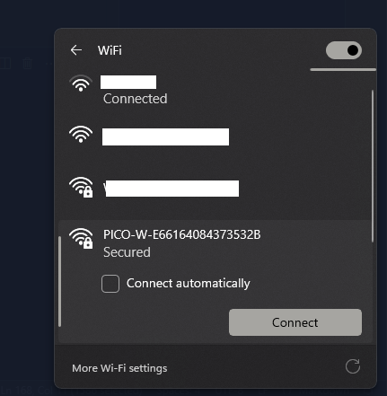

# AWS IoT Pico W 'Thing' - 'irrigation-control'


## Introduction

<!-- [!TIP] [!IMPORTANT] [!WARNING] [!CAUTION] -->

This is a MicroPython project for an irrigation control system, using a Raspberry Pi Pico W 'thing' in an AWS IoT Core context. The Pico acts as an irrigation control, reading soil moisture sensors and activating motorised ball valves, which facilitate the irrigation of their respective zones.

Telemetry is published using MQTT with AWS IoT Core service as a broker. Data is stored in an AWS S3 bucket with storage triggered by an AWS IoT message routing rule alongside an Amazon Data Firehose stream. This stream batches messages, thereby limiting S3 writes.

> [!NOTE]  
> This project is a WIP and full setup details, diagrams & guide are to follow in the near future.

## Equipment Used

The project equipment and sensors are detailed below. All items were purchased from [The Pi Hut](https://thepihut.com/), except the moisture sensor and the Wago project enclosure.

### Raspberry Pi Pico W

The Raspberry Pi Pico W is a wireless-enabled version of the RP2040-based board, adding 2.4GHz 802.11n WiFi connectivity. WiFi is enabled via the use of an Infineon CYW43439 wireless chip. The CYW43439 supports IEEE 802.11 b/g/n wireless LAN, and Bluetooth 5.2.

I plan on replacing the Pico W with the Pico 2 W in the near future. This would require another irrigation board as the Pico must be soldered onto the board.

### BC Robotics Pico Irrigation board

The Raspberry Pi Pico Irrigation Board is an all-in-one 5 channel MOSFET breakout complete with a DC power converter for the Raspberry Pi Pico and Pico W. This board allows the Pico to operate within a 12V system and switch high current inductive loads such as solenoids, pumps, or large relays. Product can be purchased from [Pi Hut](https://thepihut.com/products/irrigation-board-for-raspberry-pi-pico).

#### Drawing


#### Schematic


#### ADC 3 Schematic


### Pino-Tech SoilWatch 10 Moisture Sensor

[SoilWatch 10](https://pino-tech.eu/soilwatch10/) is a soil moisture sensor that allows you to measure relative water content in the soil. This project uses three sensors.


### Wago Wagobox Capsule

The [Wagobox Capsule](https://www.wago.com/gb/installation-terminal-blocks-and-connectors/wago-box/p/207-3306) is an IP68 enclosure and is used as a waterproof container for the project.


## Project Development Details

The default `main.py` runs an async application function (`async_main`), which carries out the related and dependent tasks detailed below.

### Establish & monitor WLAN connection

1. Attempt WiFi STA connection using env/secrets
2. Synchronise network time on STA connection
3. Monitor for connection issues
4. Wait 15 seconds and check connection again
5. Start Microdot server on WiFi connection fail
    1. Serve HTML form to update WiFi credentials
    2. Update env/secrets if correct
    3. Shutdown server & attempt WiFi connection
    4. Synchronise network time on STA connection
6. Repeat steps 3 - 5 as necessary

### Facilitate AWS IoT Core communication over MQTT

1. Publish telemetry data at set intervals
2. Carry out tasks in command topic messages
    1. Read data from moisture sensor
    2. Activate solenoid valve

### Project Layout

The project is laid out as below. The certification must be setup and generated on AWS IoT Core and loaded onto your device. The `der` certificates are listed below as an example and are not included.

```text
src/aws_iot_pico_irrigation_control
├── certs
│   ├── AmazonRootCA1.cer                   <-- AWS CA certificate 
│   ├── irrigation-control.certificate.der  <-- AWS IoT Core 'thing' certificate 
│   └── irrigation-control.private.key.der  <-- AWS IoT Core 'thing' private key 
├── env
│   └── secrets.py                          <-- WiFi & AWS credentials for STA/AP mode
├── lib
│   ├── microdot                            <-- microdot library
│   │   ├── __init__.py
│   │   └── microdot.py
│   ├── project                             <-- project custom modules
│   │   ├── connection.py
│   │   ├── irrigation.py
│   │   ├── telemetry.py
│   │   └── utility.py
│   └── umqtt                               <-- MicroPython umqtt library
│       ├── robust.py
│       └── simple.py
└── server                                  <-- microdot server files
    ├── assets
    │   ├── bootstrap.min.css.gz
    │   └── favicon.ico.gz
    └── index.html
```

`micropython-default/src/aws_iot_pico_irrigation_control` is the main project directory.

The `env/secrets.py` is used to store credentials to connect to a WiFi network and to connect to the Pico, when in AP mode. The secrets file also stores the AWS IoT Core MQTT endpoint and client ID. The default secrets file contents are shown below as an example.

```python
AP_SSID = None
AP_PASSWORD = None
WLAN_SSID = None
WLAN_PASSWORD = None
MQTT_ENDPOINT = None  # must replace
MQTT_CLIENT_ID = None # must replace
```

Example updated secrets:

```python
AP_SSID = None
AP_PASSWORD = None
WLAN_SSID = "MY_WIFI_SSID"
WLAN_PASSWORD = "MY_WIFI_PASSWORD"
MQTT_ENDPOINT = "************-****.iot.eu-****-1.amazonaws.com"
MQTT_CLIENT_ID = "my-client-id"
```

These values are dynamically imported/set using `dynamic_get_secret` and `dynamic_set_secret` in the `lib/project/utility.py` module. This functions facilitate secret variable imports like a python module, even after a secret value change.

The `lib` directory is used to host MicroPython packages locally to aid in development. This template uses the umqtt MicroPython library and the microdot framework, which is compatible with MicroPython. The `lib/project` directory is meant to store custom modules for your project.

The `server` directory holds assets and an `index.html` file, which creates a form served by the microdot server. This form is styled using bootstrap, in offline mode. Bootstrap is too big normally, but we demonstrate the realms of the possible using microdot to serve gzip-compressed bootstrap assets - useful for those wanting to know how to achieve this with such minimal resources on a microcontroller.

> [!TIP]  
> Detailed docstrings are included at the module and function/class level for this project.

### Installation

**uv** is used as the Python package manager. To install **uv** see the installation
guide @ [uv documentation](https://docs.astral.sh/uv/getting-started/installation/).

The following command will sync the project dependencies and create a virtual environment:

```bash
cd <project directory>
uv sync
```

Activate the virtual environment created by uv with the following command:

```bash
source .venv/bin/activate
```

### Build & distribute the template

> [!WARNING]  
> Make sure your Pico W device is connected and your virtual environment is activated.

Check your Pico's current filesystem with the following `mpremote` command:

```bash
(aws-iot-pico-irrigation-control) mpremote fs ls
```

Output of `ls :` will indicate an empty system. The following command will clear the Pico filesystem (use caution):

```bash
(aws-iot-pico-irrigation-control) mpremote exec --no-follow "import os, machine, rp2; os.umount('/'); bdev = rp2.Flash(); os.VfsLfs2.mkfs(bdev, progsize=256); vfs = os.VfsLfs2(bdev, progsize=256); os.mount(vfs, '/'); machine.reset()"
```

You can also use my [`andyrids/picoproject`](https://github.com/andyrids/picoproject) CLI, which is included as a **dev** dependency. The following CLI command uses `mpremote` as detailed above:

```bash
(aws-iot-pico-irrigation-control) CLI format
```

Once you have setup your IoT 'thing' correctly on AWS console and added your credentials to the secrets file, you could use the following command from the project root directory, and recursively copy all files within the project
directory to the Pico W filesystem:

```bash
$ (aws-iot-pico-irrigation-control) mpremote cp -r ./src/aws_iot_pico_irrigation_control/* :
cp ./src/aws_iot_pico_irrigation_control/env :
cp ./src/aws_iot_pico_irrigation_control/lib :
cp ./src/aws_iot_pico_irrigation_control/main.py :  
cp ./src/aws_iot_pico_irrigation_control/server :
```

You can also export the project files into a separate `./export/` directory, before copying over to the using the following commands:

```bash
$ (aws-iot-pico-irrigation-control) CLI export
$ (aws-iot-pico-irrigation-control) mpremote cp -r ./export/* :
cp ./export/env :
cp ./export/lib :
cp ./export/main.py :  
cp ./export/server :
```

You can verify with the following command:

```bash
(aws-iot-pico-irrigation-control) mpremote fs ls
```

A hard reset of the device and a connection to the device `REPL`, will allow you to view the application running with verbose debug messages (set `main.py` `_VERBOSE` global variable to False to disable):

```bash
(aws-iot-pico-irrigation-control) mpremote reset
```

Connect to the device to view the verbose debug messages:

```sh
(aws-iot-pico-irrigation-control) mpremote
```

If you have not set credentials in `env/secrets.py`, the application will detect a connection issue and initialise the Pico WLAN in AP mode and start a microdot server. You can connect to the Pico W WLAN, which will have an SSID like PICO-W-<PICO_SERIAL_NUMBER> e.g. 'PICO-W-E66161234567891B'.

The default password to connect to the Pico W will be the <PICO_SERIAL_NUMBER> in the SSID, unless you have set another value in `env/secrets.py` e.g. `AP_PASSWORD = "my_password"`.



You can view the WLAN credentials form by navigating to `http://192.168.4.1:80` or the on the [GitHub page](https://andyrids.github.io/micropython-default/) for this project. On the Github page, the Device & MicroPython version details are unavailable as these are populated based on your Pico W details.


> [!WARNING]  
> Must be HTTP - i.e. `http://192.168.4.1:80/`

Example output:

```bash
$ (micropython-default) mpremote
Connected to MicroPython at /dev/ttyACM0
Use Ctrl-] or Ctrl-x to exit this shell
NETWORK INTERFACE ACTIVE - AP MODE

WLAN INFO
---------
MODE: AP
STATUS: 3
ACTIVE: True
CONNECTED: True

ASYNC TASK - GARBAGE COLLECTION
ENTERING MAIN LOOP
ASYNC TASK - GARBAGE COLLECTION
CONNECTION ISSUE - STATUS: 3
AFTER MICRODOT SERVER STARTUP:
1. CONNECT TO PICO W WLAN
2. NAVIGATE TO http://192.168.4.1:80
3. ENTER YOUR WLAN SSID & PASSWORD
ASYNC TASK - MICRODOT SERVER STARTUP
Starting async server on 0.0.0.0:80...
ASYNC TASK - GARBAGE COLLECTION
ASYNC TASK - GARBAGE COLLECTION
ASYNC TASK - GARBAGE COLLECTION
```

After the WLAN credentials form has been submitted and credentials prove to be correct:

```bash
POST /connection 205
ASYNC TASK - MICRODOT SERVER SHUTDOWN
RESETTING WLAN INTERFACE
INITIALISE NETWORK WLAN INSTANCE
SETTING WLAN MODE TO STA
ACTIVATE NETWORK INTERFACE
ACTIVATE NETWORK INTERFACE TIMEOUT - STA MODE
CONNECTING TO SSID '**********'
WAITING FOR WLAN CONNECTION
WLAN STATUS: 1
WLAN STATUS: 1
WLAN STATUS: 1
WLAN STATUS: 1
WLAN STATUS: 2
WLAN STATUS: 2
WLAN STATUS: 3
WLAN CONNECTION SUCCESSFUL - SSID: '**********'

WLAN INFO
---------
MODE: STA
STATUS: 3
ACTIVE: True
CONNECTED: True

CONNECTION ISSUE RESOLVED
ASYNC TASK - GARBAGE COLLECTION
GET /reset 200
ASYNC TASK - SYNCHRONISE NETWORK TIME
SET NTPTIME SUCCESS - 2024-12-16 21:26:1
```

You can interrupt the main application from the REPL you connected to with the last `mpremote` command, by pressing ctrl + c.

```bash
ASYNC TASK - GARBAGE COLLECTION
ASYNC TASK - GARBAGE COLLECTION
ASYNCIO.RUN KeyboardInterrupt
ASYNCIO.RUN CLEANUP
ASYNCIO.RUN TERMINATE
```

As the application is async, commands can still be issued to the device, including a hard reset or filesystem wipe using mpremote.

### MQTT Topic Design

* The maximum number of forward slashes (/) in the MQTT topic name for AWS IoT Core is seven

* Since MQTT topics are case sensitive, it is important to use a standard set of naming conventions when designing MQTT topics

`General --> Specific`

```sh
irrigation/garden/front/irrigation-control
irrigation/garden/front/irrigation-sensor

irrigation/garden/rear/irrigation-control
irrigation/garden/rear/irrigation-sensor
```

### Using the MQTT topics for telemetry

`dt/<application>/<context>/<thing-name>/<dt-type>`

* **dt**: Set prefix that refers to the type of message. For a telemetry topic, we use dt, short for data.
* **application**: Identifies the overall IoT application associated with the device.
* **context**: Single or multiple levels of additional contextual data about the message a device is publishing.
* **thing-name**: Identifies which device is transmitting a telemetry message.
* **dt-type** (optional): Associates a message with a particular subcomponent of a device.

```sh
dt/irrigation/garden/irrigation-control/moisture
dt/irrigation/garden/irrigation-sensor/temperature
```

## MQTT command topic syntax

Send commands:
`cmd/<application>/<context>/<destination-id>/<req-type>`

Respond to commands:
`cmd/<application>/<context>/<destination-id>/<res-type>`

* **cmd**: Prefix that refers to the type of message. Command topics use cmd.
* **req-type**: Classifies the command.
* **destination-id**: Identifies the destination device or application for this message.
* **res-type**: Denotes command responses and identifies responses that are related to a previously sent command.

```sh
cmd/irrigation/garden/irrigation-control/zone
cmd/irrigation/garden/irrigation-control/telemetry
```

## MQTT command payload syntax

* **session-id**: Identifies a unique session. A requestor generates a session-id for the command and includes it in the request payload.
* **response-topic**: In a command, there is a request for an action to happen and a response that indicates the status of the command (successful or error).

Requestor --> Recipient

`cmd/security/device-1/cert-rotation`

In the payload of this request, the IoT application includes a field that denotes where the device (device-1) should send its response and a session identifier for tracking:

```JSON
{ "session-id": "session-1234", "response-topic": "cmd/security/app1/res" }
```

## Best practices for using AWS IoT Basic Ingest

Basic Ingest optimizes data flow for high volume data ingestion workloads by removing the pub/sub Message Broker from the ingestion path. As a result, you have a more cost-effective option to send device data to other AWS services while continuing to benefit from all the security and data processing features of AWS IoT Core.

Include any additional routing information after the rule name in the Basic Ingest MQTT Topic. As a best practice, AWS recommends you use the optional segments that can appear after the rule name in the MQTT topic to include relevant additional information that can be used by the AWS IoT Rule for features such as Substitution Templates, IoT Rule SQL Functions, and Where Clauses.

`$aws/rules/<rule-name>/<optional-customer-defined-segments>`

```sh
$aws/rules/IrrigationData/garden/front/moisture
$aws/rules/IrrigationData/garden/front/moisture

$aws/rules/IrrigationData/garden/rear/moisture
$aws/rules/IrrigationData/garden/rear/moisture

$aws/rules/IrrigationData/garden/+/moisture
```

IoT 'IrrigationData' Rule & SQL Function:

```JSON
// MQTT message --> $aws/rules/IrrigationData/garden/rear/moisture

{ "thing-id": "irrigation-control", "sensor-id": 0, "timestamp": 1727811027, "reading-u16": 15666, "reading-vdc": 0.145 }
{ "thing-id": "irrigation-control", "sensor-id": 1, "timestamp": 1727811028, "reading-u16": 15666, "reading-vdc": 0.145 }
{ "thing-id": "irrigation-control", "sensor-id": 2, "timestamp": 1727811029, "reading-u16": 15666, "reading-vdc": 0.145 }
```

```SQL
SELECT reading FROM '$aws/rules/IrrigationData/garden/+/moisture' WHERE *
```

JSON:

```JSON
{
    sensor_id: "",
    reading: 16516,
    timestamp: 12345678,
}
```

### Sphinx Documentation

To build the documentation with sphinx, follow the commands below:

```bash
(aws-iot-pico-irrigation-control) cd docs
(aws-iot-pico-irrigation-control) make html
```

## Credits

1. Peter Hinch's excellent guide on [asyncio](https://github.com/peterhinch/micropython-async)
2. [Microdot](https://microdot.readthedocs.io/en/latest/) minimalistic Python web framework inspired by Flask
3. A detailed guide on [mpremote](https://wellys.com/posts/rp2040_mpremote/)
4. MicroPython dev environment using [WSL & Void Linux](https://github.com/andyrids/void-wsl-dev)
